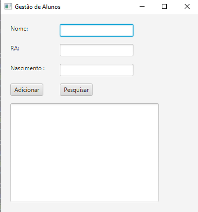

## Aluno (Boundary e Entity) - Simplificado

Exercício - Aluno (Boundary e Entity) – Simplificado Usando Java FX

Crie um CRUD com dois botões (Adicionar) e (Pesquisar) para fazer a manutenção de aluno, contendo o Boundary e a Entidade (BE), ao clicar no Adicionar o sistema deve criar uma instância de aluno e colocá-lo em uma lista. Ao clicar em Pesquisar o sistema deve procurar na lista pelo primeiro aluno contando o nome de acordo com o conteúdo escrito no TextField do nome, e mostrar os dados do objeto encontrado na tela.

Faça a entidade Aluno, conforme layout abaixo:

Aluno:

Id        

Ra

Nome

Nascimento (pode ser tipo Date ou LocalDate)
--------------------------------------------------------------
Tela Aluno Crud :

